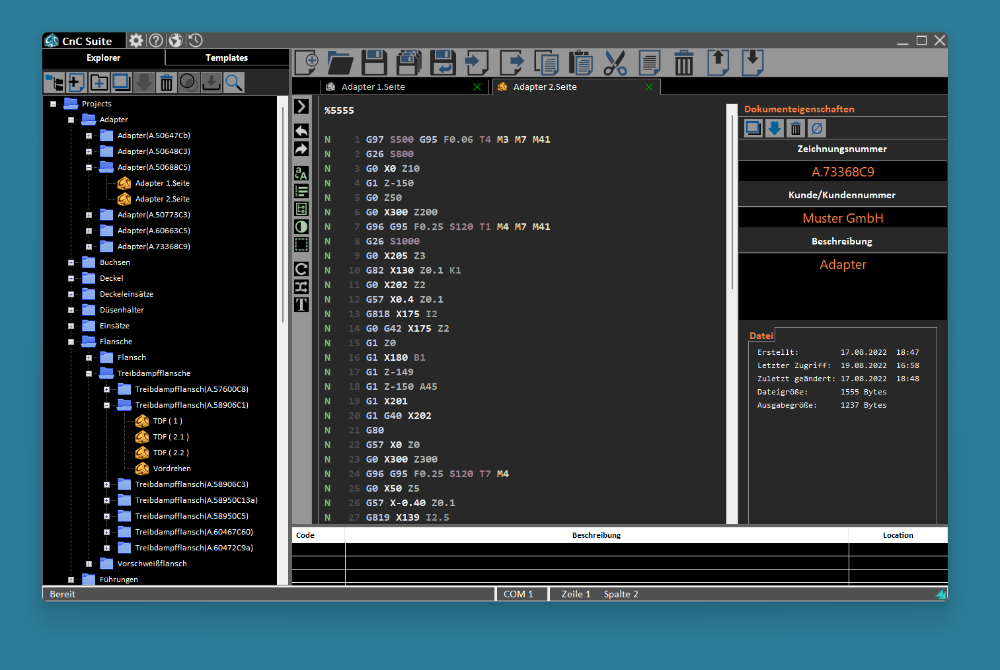

# CnC-Suite - Extended NC-Editor
The purpose of this application is to create, manage, transmit and archive nc-content files. It was created for EPL2 based programs and machines but should also fullfill the need for other issues where editing of g-code is required. A special file format *.cnc3 is used for storing files. These files have tags describing the content, like *.mp3 for example. This enables the facility to save extra data with the files and later search for it. 
The application consists of the following fragments:
- File explorer box to create, open, save and copy files
- Tabcontrol to edit several files at the same time
- Template box to create, manage and insert snippets of code
- Document-property box to add tags (decriptions) to the saved files
- Search functionality to search through the tag-content (file-descriptions) or of cource filenames and foldernames
- History box to show the history of edited files
- Serial transmission functionality to send/receive files over a serial interface

The application is a Windows-Application and is primary written in C++. Supported OS-Versions are Windows 7/10/11. This project includes the source for the executable and NSI scripts to generate an installer with NSIS.

ToDo: Add link to website where to download the installers! And how to use!?

## How to build the executable:
- Download and Install [Visual Studio 2022 (Community)](https://visualstudio.microsoft.com/de/downloads/) and make sure to install the C++ Desktop Development Package
- Open Visual Studio
- Click on "Clone Repository" on the right side
- Copy the Repository path from GitHub.com and paste it
- Click on Clone button
- When cloning is finished, open the project
- Select the desired build configuration (Release/Debug and x86/x64) in the toolbar
- Click on the Build-Button.

**NOTE:**

When built in Release mode, the output location of the executables is set to the appropriate installer directory: *($ProjectDirectory)/Installer/buildOutput* (depending on the target platform).
This folder is the source location for the installer generation. The output directory can be changed in the Visual Studio project properties.

## How to build the installer:
- Download and install the [Nullsoft Scriptable Install System (NSIS)](https://nsis.sourceforge.io/Download)
- The scripts are located in the Installer directory, the names identify the target platform and the type (user/admin)
- Open NSIS and click on *Compile NSI scripts* 
- Open the appropriate script for the desired target platform x86/x64, the installer will be built automatically and the results are displayed in the textbox
- The default output location of the generated installer is *($ProjectDirectory)/Installer/installer_output/*
- Optional: To edit the scripts I would recommend to download [Visual Studio Code](https://code.visualstudio.com/) and when done, install the NSIS language support extension from the Extension Marketplace inside VS Code.

**NOTE:**

The installer section contains nsis files for x86/x64 target platform for two types of installations, the user and the admin type. Means when creating the classic installer which requires administrator privilegues, the application is installed in the programs folder and uses the HKLM registry section of the target machine. This is out-dated. I would recommend to use the user-installer scripts instead. When build from these scripts, no administrator privilegues are required and the application is installed to the local app-data folder and uses the HKCU registry section of the target machine.

## How to use the application
Instructions how to use this app are available here.  TODO: add url to website
